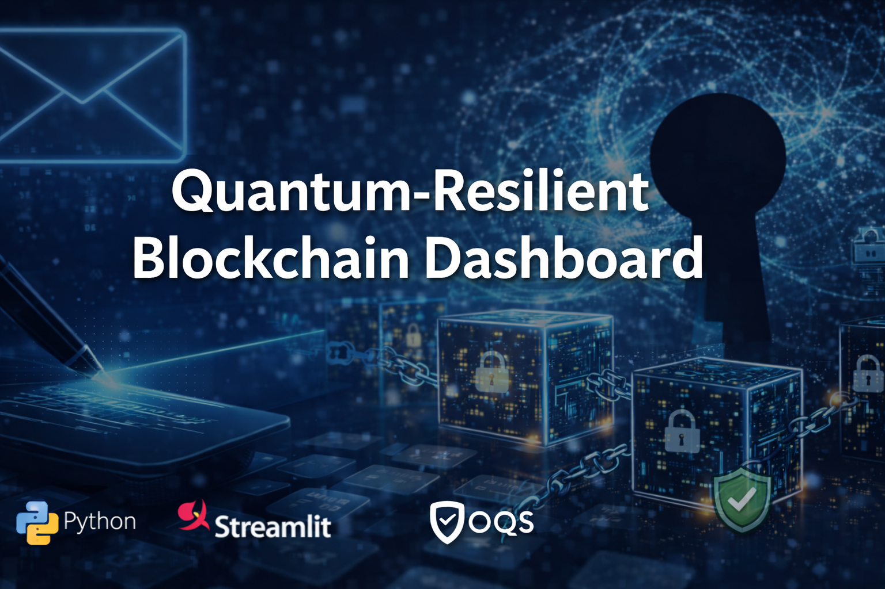

# Quantum-Resilient Blockchain Dashboard


A hands-on blockchain learning dashboard that combines **post-quantum digital signatures**, **block creation**, **chain validation**, and **tampering experiments** in a single Streamlit application.



## 1. Project Overview

This project was designed to explain blockchain to beginners through a guided, step-by-step interface while also introducing a more advanced security theme: **post-quantum cryptography (PQC)**.

Instead of using a traditional ECDSA-based example, this demo signs transactions with a PQC signature mechanism provided by **liboqs**. The application allows a user to:

- create wallets,
- sign transactions,
- queue transactions,
- package queued transactions into blocks,
- validate chain integrity,
- inspect block-level JSON data,
- intentionally tamper with a recorded transaction,
- and observe why integrity verification fails afterward.

The result is a compact educational blockchain simulator with a modern visual dashboard.

## 2. Why This Project Matters

Many introductory blockchain demos stop at "hashing two blocks together." That is useful, but incomplete.

This project was built to show the full conceptual chain:

- **A person creates a transaction**
- **The transaction is signed**
- **Signed transactions are grouped into a block**
- **Blocks are chained with hashes**
- **The chain can be validated**
- **Tampering becomes detectable**

On top of that, this project asks a forward-looking question:

> What happens if future blockchain systems need to migrate toward post-quantum signature schemes?

This makes the repository useful both as a beginner-friendly blockchain demonstration and as a portfolio project that highlights security awareness beyond standard toy implementations.

## 3. Core Features

### 3.1 Wallet Generation
The app creates three demo wallets: **Alice**, **Bob**, and **Charlie**.

Each wallet contains:

- a PQC public key,
- a PQC secret key,
- a simplified wallet address derived from the public key.

### 3.2 Post-Quantum Signatures
Transactions are signed with a PQC signature algorithm selected from the locally enabled OQS mechanisms.

Preferred order:

- ML-DSA
- Dilithium-compatible naming
- Falcon
- SPHINCS / SLH-DSA

### 3.3 Pending Transaction Queue
After a user creates a signed transaction, it is first stored in a **pending queue** rather than being written into a block immediately.

This mirrors the conceptual idea of a mempool, although the implementation is intentionally simplified.

### 3.4 Block Creation
Queued transactions can be packaged into a new block.

Each block contains:

- block index,
- timestamp,
- transaction list,
- previous block hash,
- nonce placeholder,
- current block hash.

### 3.5 Chain Validation
The app validates:

- the block hash,
- the previous block linkage,
- all signatures inside each block.

### 3.6 Tampering Experiment
A dedicated experiment mutates the amount inside the first real transaction. Once changed, the chain should no longer validate.

This is one of the most important educational parts of the project because it shows *why* blockchain data is considered hard to alter undetectably.

## 4. Technical Stack

- **Python 3.11**
- **Streamlit**
- **liboqs-python**
- **liboqs**
- **SHA-256** via Python `hashlib`
- **JSON / Base64** for serialization and encoding
- **Dataclasses** for domain modeling
- **Windows local environment** with Anaconda

## 5. Repository Structure

```text
pqc_blockchain_streamlit_pkg/
├── app.py
├── README.md
├── requirements.txt
├── LICENSE
├── NOTICE
├── .gitignore
└── assets/
    └── cover.png
```

## 6. How the Application Works

### Step 1. Create a Transaction
The user selects:

- sender,
- receiver,
- amount.

Then the user clicks **Sign and Add to Pending Queue**.

Internally, the app:

1. builds a transaction payload,
2. signs it with the sender's PQC secret key,
3. stores the signed transaction in the pending list.

### Step 2. Create a Block
The user clicks **Create a New Block from Pending Transactions**.

The app:

1. verifies every pending transaction,
2. packages them into a block,
3. computes the new block hash,
4. appends the block to the chain.

### Step 3. Validate the Chain
The user clicks **Run Chain Validation**.

The app checks:

- whether the current block hash still matches recomputed data,
- whether the previous hash linkage is correct,
- whether transaction signatures are still valid.

### Step 4. Inspect Blockchain Data
The dashboard shows a summary table of all blocks and allows block-level JSON inspection.

This is useful for education because users can directly see the internal structure that is normally hidden in simplified diagrams.

### Step 5. Tampering Experiment
The user clicks **Tamper with the First Real Transaction**.

The app modifies the amount field inside a block that is already part of the chain. That change should make validation fail when the chain is checked again.

## 7. Educational Value

This project is especially useful for:

- blockchain beginners,
- portfolio presentation,
- classroom demonstration,
- security-focused software engineering discussion,
- explaining why integrity validation matters.

It is intentionally not a production blockchain, and that is by design. The goal is clarity and explainability.

## 8. What This Project Includes vs. Omits

### Included
- digital signatures,
- blocks,
- chained hashes,
- transaction validation,
- tamper detection,
- UI-driven learning flow.

### Not Included
- peer-to-peer networking,
- consensus,
- mining,
- gas/fees,
- UTXO accounting,
- Merkle trees,
- persistent storage,
- production wallet security.

This makes the project appropriate as a **conceptual blockchain engine**, not a deployable ledger.

## 9. Setup Instructions

### 9.1 Create the environment

```bash
conda create -n pqc_chain_env python=3.11 -y
conda activate pqc_chain_env
python -m pip install --upgrade pip setuptools wheel
pip install -r requirements.txt
```

### 9.2 Install `liboqs`

`liboqs-python` requires the native `liboqs` library. On Windows, this often means building `liboqs` first and making sure `oqs.dll` is visible in `PATH`.

A typical flow is:

1. install Visual Studio Build Tools with C++ support,
2. install Git and CMake,
3. build `liboqs`,
4. add the `bin` folder containing `oqs.dll` to `PATH`.

### 9.3 Run the app

```bash
conda activate pqc_chain_env
set PATH=%PATH%;%USERPROFILE%\_oqs\bin
set OQS_INSTALL_PATH=%USERPROFILE%\_oqs
streamlit run app.py
```

Then open the Streamlit local URL in your browser.

## 10. Recommended GitHub Repository Name

**Repository name**

```text
quantum-resilient-blockchain-dashboard
```

Alternative options:

- `pqc-blockchain-dashboard`
- `pqc-blockchain-demo`
- `post-quantum-blockchain-simulator`

## 11. Recommended GitHub Description

Use one of the following.

### Recommended primary description

```text
A Streamlit-based blockchain simulator with post-quantum signatures, block validation, and tampering experiments.
```

### Alternative description

```text
Interactive PQC blockchain demo built with Python, Streamlit, and liboqs for learning transaction signing and chain integrity.
```

## 12. Recommended Topics / Tags

Suggested GitHub topics:

```text
blockchain, post-quantum-cryptography, pqc, streamlit, python, liboqs, cybersecurity, cryptography, dashboard, education
```

## 13. GitHub Badge Set

Paste the following directly into your GitHub `README.md`.

```md


```

## 14. Copyright and Usage Notice

This repository is provided for portfolio, demonstration, and educational purposes.

Unless the owner explicitly grants additional permission, all code, design assets, documentation, screenshots, and derivative materials are protected under an **all rights reserved** notice.

See `LICENSE` and `NOTICE` for details.

## 15. Future Extensions

Possible next versions of the project:

- Merkle tree integration,
- transaction fee modeling,
- balance tracking,
- hybrid signature mode (ECDSA + PQC),
- persistent storage,
- advanced blockchain visualization,
- beginner mode vs. expert mode UI,
- multi-node simulation.

## 16. Final Summary

**Quantum-Resilient Blockchain Dashboard** is a portfolio project that combines:

- blockchain basics,
- post-quantum signatures,
- interactive UI design,
- and security-oriented experimentation.

It is intentionally simple in system scope, but strong in educational clarity and technical storytelling.
